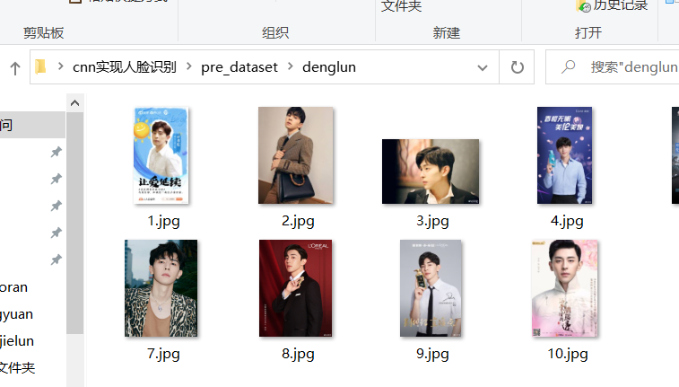
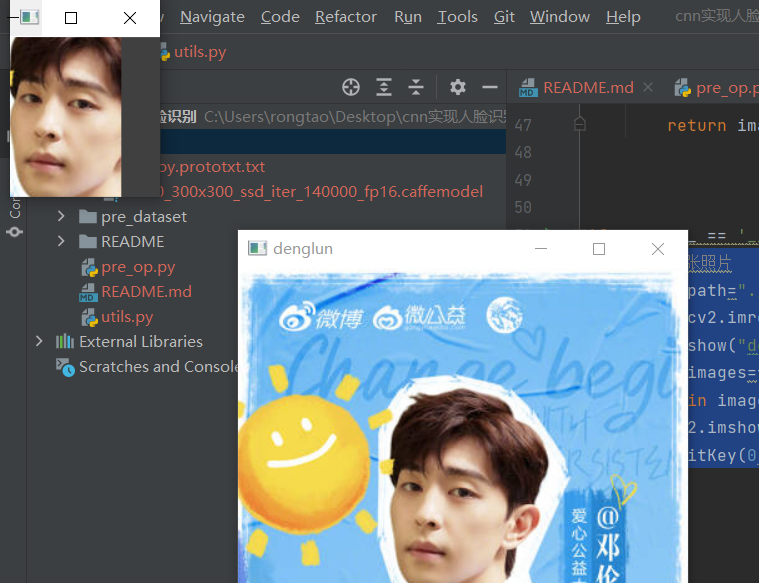
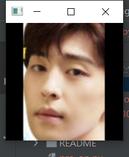
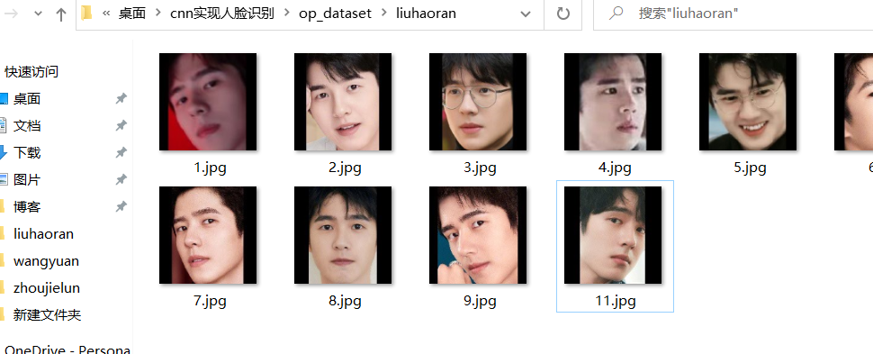
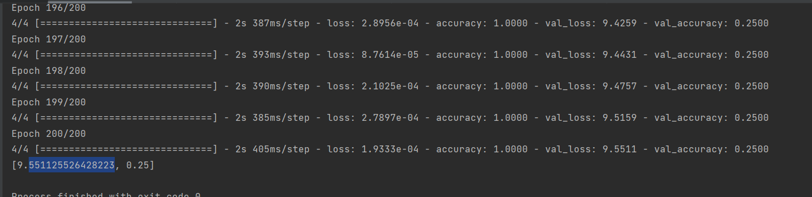
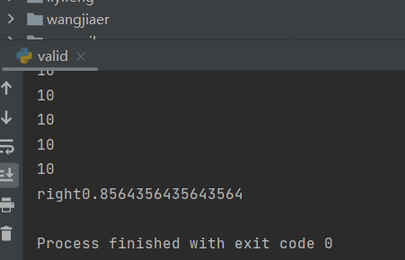

# 1.对图片进行预处理utils.py



一共是十个文件夹，都是从微博下载下来的，对原始图片需要的是进行识别、裁剪；有很多种方法可以成功，笔者尝试效果比较好的是caffemodel或者haarcascade_frontalface_alt2.xml这个分类器

#### 1.识别函数在`utils.py`这个文件中，传入的是cv2读取的图片，返回原照片已经识别到的人脸数组。

```python
#测试一张照片
image_path="./pre_dataset/denglun/1.jpg"
image=cv2.imread(image_path)
cv2.imshow("denglun",image)
image,images=face_detector_dnn(image)
for i in images:
    cv2.imshow("dele ",i)
    cv2.waitKey(0)
```

识别效果



#### 2.对照片进行扩充或者缩放，由于本模型训练的输入是160*160



此处的结果小于160像素，进行了黑边填充

至此识别以及裁剪的工具类`utils.py`已经实现完毕

# 2.对数据集进行批量操作pre_data.py

其实就是调用第一步的函数，以及建立文件夹等操作

```
if __name__ == '__main__':
    # 遍历pre_dataset
    for i in os.listdir(PRE_DATASET):  # i为姓名
        input_dir = PRE_DATASET + "/" + i  # ./pre_dataset/zhoujielun
        output_dir = OP_DATASET + "/" + i
        #如果out_dir不存在建立该文件夹
        folder = os.path.exists(output_dir)
        if not folder:
            os.mkdir(output_dir)
        _index = 0
        for j in os.listdir(input_dir):
            image_path = input_dir + "/" + j #./pre_dataset/zhoujielun/7.jpg
            image = cv2.imread(image_path)
            image,images=utils.face_detector_dnn(image)
            for face in images:
                #将人脸存回去
                face=utils.resize_image(face)
                _index+=1
                cv2.imwrite(output_dir+"/%d.jpg"%_index,face)
                print("存放"+output_dir+"/%d.jpg"%_index)
                #调用识别以及裁剪函数
```



# 3.训练`op_model.py`

主要是CLASSES输入类别个数，而模型是AlexNet.py文件中

200次训练结果：



# 4.测试结果test.py

## 1.摄像头预测 test.py


## 2.数据集跑测试valid.py

